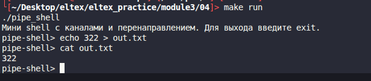

# Module 3 task 04

## Командный интерпретатор с каналами и перенаправлением

Программа похожа на shell из задания 02, но поддерживает конвейер через `|`,
ввод из файла через `<`, вывод в файл через `>` и добавление в файл через `>>`.

Парсер простой: команды, аргументы и символы `|`, `<`, `>`, `>>` нужно отделять
пробелами.

Сборка:

```bash
make
```

Запуск:

```bash
./pipe_shell
```

Примеры команд:

```bash
ls -la | wc -l
cat < input.txt | grep hello > output.txt
cat output.txt | wc -w
exit
```



Очистка:

```bash
make clean
```
