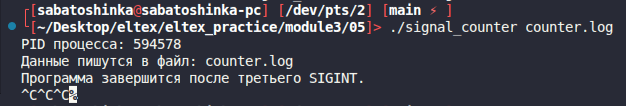
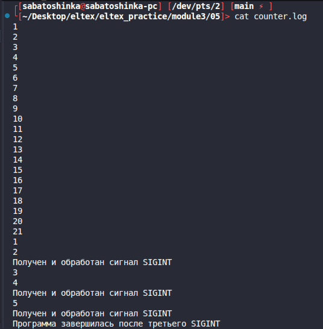

# Module 3 task 05

## Счетчик и обработка сигналов

Программа раз в секунду пишет в файл значение счетчика. При получении `SIGINT`
или `SIGQUIT` в тот же файл записывается сообщение о полученном сигнале.
Оба сигнала обрабатывает одна функция-обработчик.

После третьего `SIGINT` программа закрывает файл и завершается.

Сборка:

```bash
make
```

Запуск:

```bash
./signal_counter counter.log 
```
Тест:


Лог:

Примеры проверки:

```bash
ps
kill -SIGQUIT <pid>
kill -SIGINT <pid>
kill -SIGINT <pid>
kill -SIGINT <pid>
cat counter.log
```

Очистка:

```bash
make clean
```
