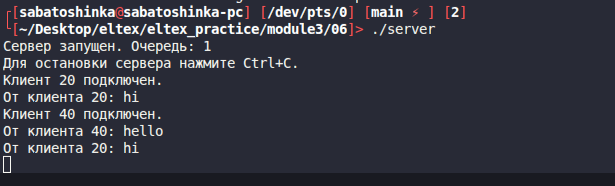
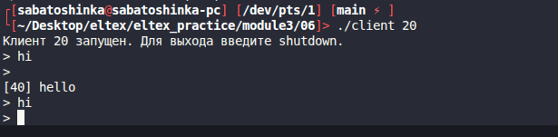
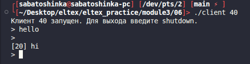

# Module 3 task 06

## Групповой чат через очередь сообщений System V

Есть две программы: `server` и `client`. Используется одна очередь сообщений.
Тип сообщения `10` предназначен серверу, клиенты используют типы `20`, `30`,
`40` и так далее.

Сервер принимает сообщения от клиентов и пересылает их всем другим активным
клиентам. Если клиент отправляет `shutdown`, сервер больше не пересылает ему
сообщения.

Сборка:

```bash
make
```

Запуск сервера:

```bash
./server
```
Сервер

Клиент 20

Клиент 40

Запуск клиентов в других терминалах:

```bash
./client 20
./client 30
./client 40
```

Очистка:

```bash
make clean
```
