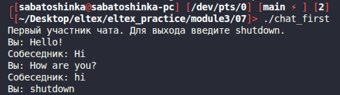
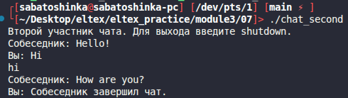

# Module 3 task 07

## Персональный чат через очереди сообщений POSIX

Используются две очереди сообщений:

- `/eltex_m3_07_to_first` для сообщений первому участнику;
- `/eltex_m3_07_to_second` для сообщений второму участнику.

Сообщения отправляются по очереди. Первый участник пишет первым, второй сначала
ждет сообщение. Для завершения нужно отправить `shutdown`; это сообщение
передается с отдельным приоритетом.

Сборка:

```bash
make
```

Запуск в двух терминалах:

```bash
./chat_first
```

```bash
./chat_second
```

Очистка:

```bash
make clean
```
