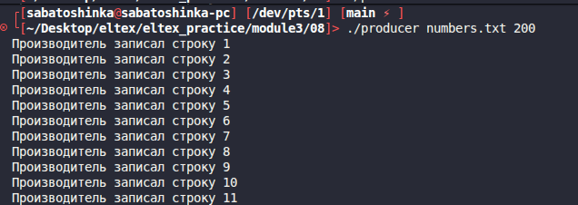
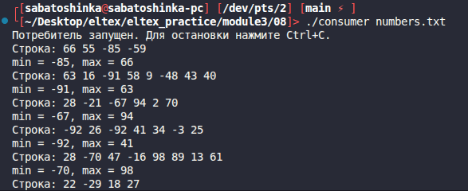
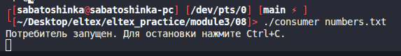

# Module 3 task 08

## Производитель и потребители с семафором System V

Программа `producer` генерирует строки из случайных чисел и записывает их в
файл. Программа `consumer` читает необработанные строки, ищет минимум и максимум
и выводит результат на экран.

Доступ к файлу защищен семафором System V. Можно запускать несколько
потребителей, строки будут разбираться по очереди. Для файла `numbers.txt`
создается служебный файл `numbers.txt.pos`, где хранится позиция чтения.

Сборка:

```bash
make
```

Запуск производителя:

```bash
./producer numbers.txt 20
```


Запуск потребителей в других терминалах:

```bash
./consumer numbers.txt
./consumer numbers.txt
```



Одновременно работает только один потребитель.

Очистка:

```bash
make clean
```
