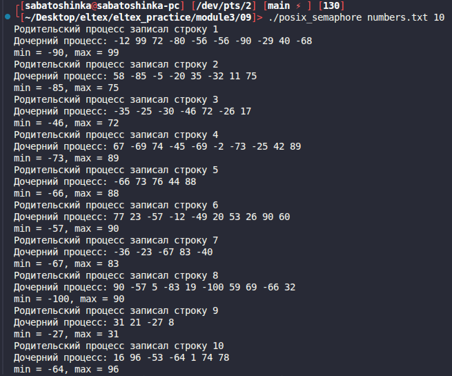

# Module 3 task 09

## Родитель и дочерний процесс с POSIX семафором

Родительский процесс генерирует строки случайных чисел и записывает их в файл.
Дочерний процесс читает новые строки, ищет минимум и максимум и выводит результат
на экран.

Доступ к файлу защищен POSIX-семафором `sem_t`. Семафор и позиция чтения лежат
в общей памяти, созданной через `mmap` перед `fork`.

Сборка:

```bash
make
```

Запуск:

```bash
./posix_semaphore numbers.txt 10
```



Очистка:

```bash
make clean
```
