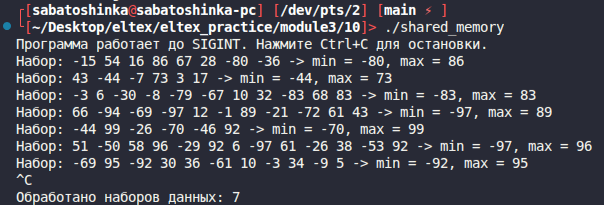

# Module 3 task 10

## Разделяемая память System V

Родительский процесс генерирует наборы случайных чисел и помещает их в
разделяемую память. Дочерний процесс читает набор, находит минимум и максимум и
записывает результат обратно в эту же область памяти. Родитель выводит
результат на экран.

Работа повторяется до получения `SIGINT`. После остановки выводится количество
обработанных наборов данных, затем разделяемая память удаляется.

Сборка:

```bash
make
```

Запуск:

```bash
./shared_memory
```



Остановка:

```bash
Ctrl+C
```

Очистка:

```bash
make clean
```
