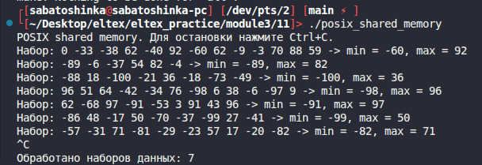

# Module 3 task 11

## Разделяемая память POSIX

Родительский процесс генерирует наборы случайных чисел и помещает их в
разделяемую память POSIX. Дочерний процесс находит минимум и максимум и
записывает результат обратно. После этого родитель выводит результат на экран.

Работа повторяется до `SIGINT`. После остановки выводится количество
обработанных наборов данных.

Сборка:

```bash
make
```

Запуск:

```bash
./posix_shared_memory
```

Очистка:

```bash
make clean
```
