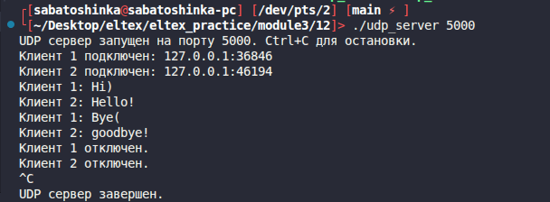
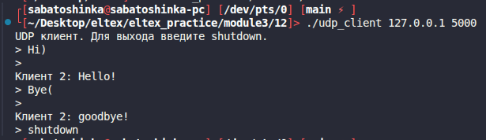
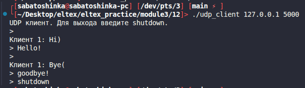

# Module 3 task 12

## UDP чат для двух клиентов

Реализован простой UDP-сервер и клиент. Сервер принимает сообщения от двух
клиентов и пересылает сообщение второго участника первому и наоборот.

Клиент использует `select`, поэтому может принимать сообщения и читать ввод с
клавиатуры в любом порядке.

Сборка:

```bash
make
```

Запуск сервера:

```bash
./udp_server 5000
```



Запуск двух клиентов:

```bash
./udp_client 127.0.0.1 5000
./udp_client 127.0.0.1 5000
```
Клиент 1


Клиент 2



Для выхода клиент отправляет:

```text
shutdown
```

Очистка:

```bash
make clean
```
