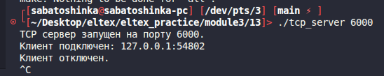
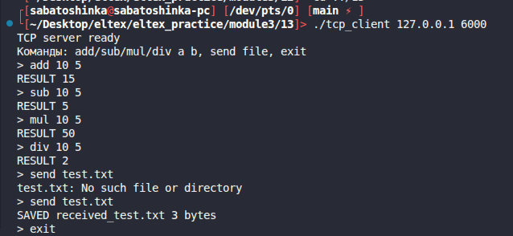
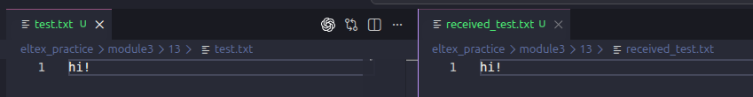

# Module 3 task 13

## TCP клиент и сервер

Сервер принимает TCP-подключение и умеет:

- складывать, вычитать, умножать и делить два числа;
- принимать файл от клиента и сохранять его с префиксом `received_`.

Сборка:

```bash
make
```

Запуск сервера:

```bash
./tcp_server 6000
```



Запуск клиента:

```bash
./tcp_client 127.0.0.1 6000
```





Команды клиента:

```text
add 10 5
sub 10 5
mul 10 5
div 10 5
send test.txt
exit
```

Очистка:

```bash
make clean
```
