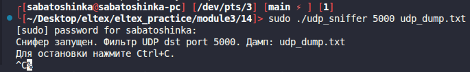
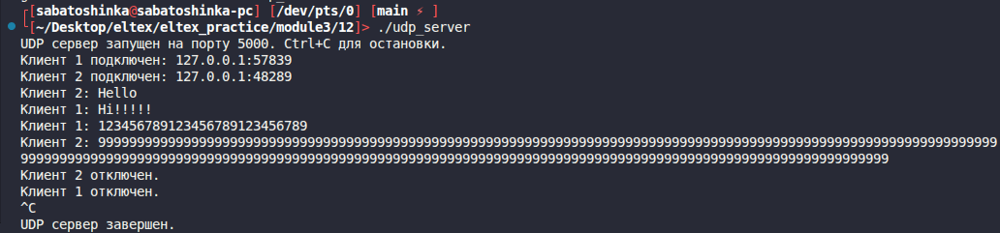
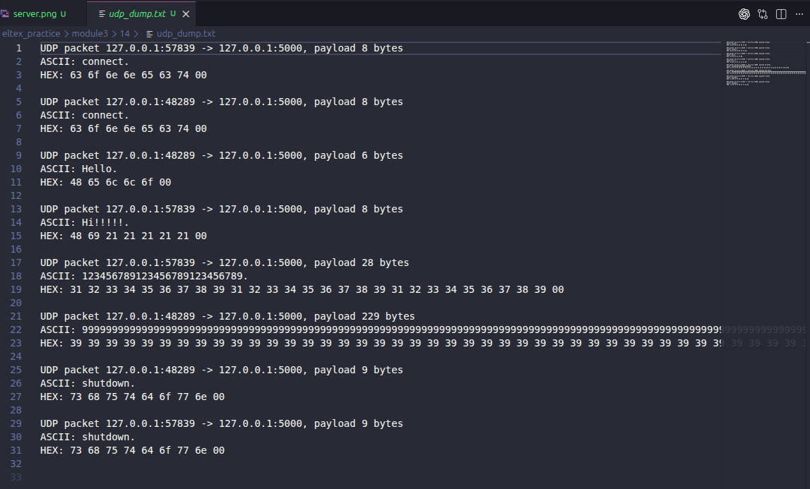

# Module 3 task 14

## RAW-снифер для UDP-чата

Программа получает копии UDP-пакетов и фильтрует сообщения, которые идут на
порт UDP-сервера из задания 12. По умолчанию используется порт `5000`.

Снифер записывает в файл адреса отправителя и получателя, ASCII-представление
payload и HEX-дамп.

Сборка:

```bash
make
```

Запуск:

```bash
sudo ./udp_sniffer 5000 udp_dump.txt
```



После этого можно запустить UDP-чат из задания 12 и отправить несколько
сообщений клиентами.

Работы на сервере 


Файл udp_dump


Очистка:

```bash
make clean
```
