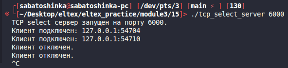
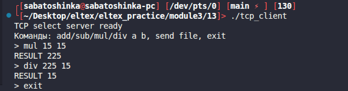
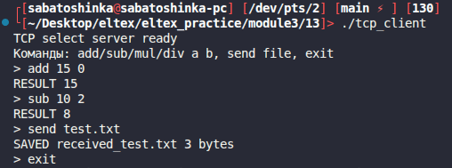

# Module 3 task 15

## TCP сервер через select

Это версия сервера из задания 13, но с мультиплексированием ввода-вывода через
`select` и одним потоком исполнения.

Поддерживаются те же команды протокола:

- `CALC add/sub/mul/div a b`;
- `FILE name size` и последующая передача байтов файла;
- `EXIT`.

Для проверки можно использовать клиента из задания 13.

Сборка:

```bash
make
```

Запуск сервера:

```bash
./tcp_select_server 6000
```



Запуск клиента из задания 13:

```bash
../13/tcp_client 127.0.0.1 6000
```




Команды:
```text
add 10 5
sub 10 5
mul 10 5
div 10 5
send test.txt
exit
```

Очистка:

```bash
make clean
```
