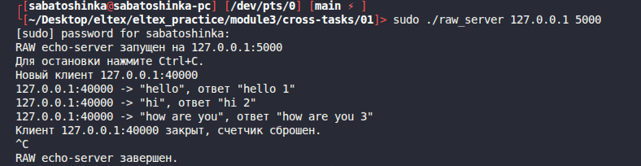
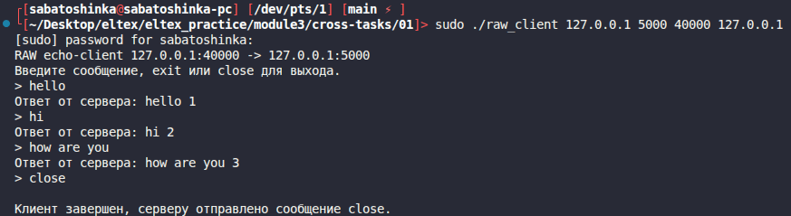
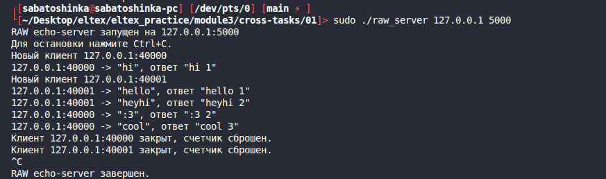
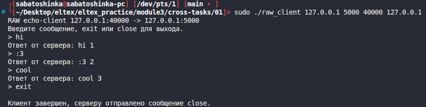
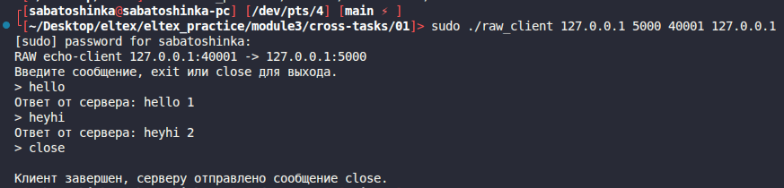

# Module 3 cross task 01

## RAW sockets + САОД + signals

Реализованы `raw_server` и `raw_client`. Протокол сообщения похож на UDP:
программа сама формирует IP- и UDP-заголовки и отправляет пакет через
RAW-сокет.

Сервер хранит клиентов в простом связном списке по паре `ip:port`. Для каждого
клиента ведется свой счетчик сообщений. Ответ сервера:

```text
<сообщение клиента> <номер сообщения этого клиента>
```

При завершении клиент отправляет серверу сообщение `close`. После этого сервер
удаляет запись клиента и при новом подключении с тем же `ip:port` начнет счет с
единицы.

Сборка:

```bash
make
```

Запуск сервера:

```bash
sudo ./raw_server 127.0.0.1 5000
```

Запуск клиента:

```bash
sudo ./raw_client 127.0.0.1 5000 40000 127.0.0.1
```

Аргументы клиента:

```text
./raw_client <server_ip> <server_port> <client_port> <client_ip>
```

Пример работы:
1.
Server:



Client:



2.
Server:



Clients:




Очистка:

```bash
make clean
```
