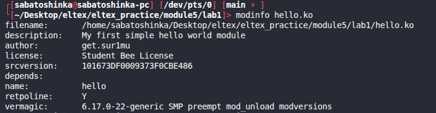
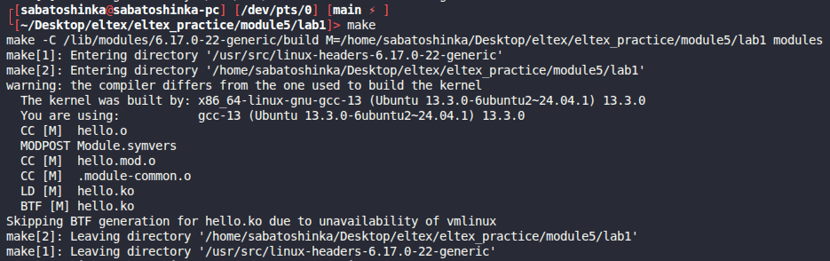
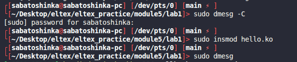
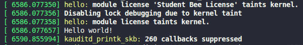

# Module 5 lab 1

## Сборка

```bash
make
```

## Работа с модулем:

```bash
sudo insmod hello.ko
dmesg | tail
sudo rmmod hello
dmesg | tail
```

## Скриншоты работы

Информация о модуле:



Сборка модуля:



Загрузка модуля:



Сообщения в dmesg:


