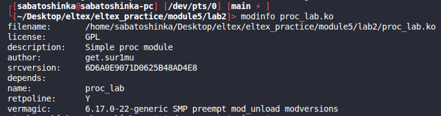
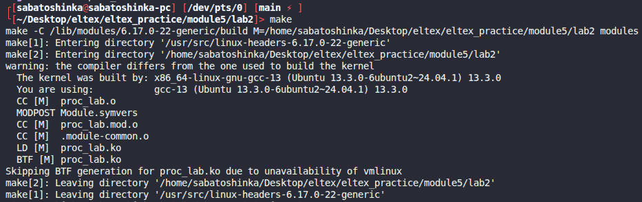
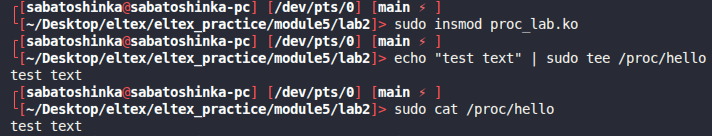

# Module 5 lab 2

## Сборка

```bash
make
```

## Запуск и проверка

```bash
sudo insmod proc_lab.ko
echo "test text" | sudo tee /proc/hello
cat /proc/hello
sudo rmmod proc_lab
```
## Дополнительно
Используется tee (Утилита, которая читает данные из stdin и одновременно выводит их в терминал, и записывает в указанный файл), т.к. если писать
```bash
sudo echo 7  > /proc/hello
```
То sudo применяется только к echo, а перенаправление выполняет shell без root'а, поэтому на лекции приходилось писать
```bash
sudo su
```

## Скриншоты работы
Информация о модуле:



Сборка модуля:



Загрузка модуля:


