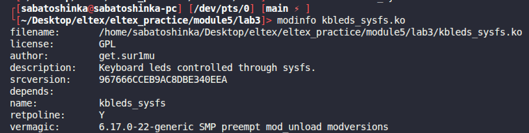
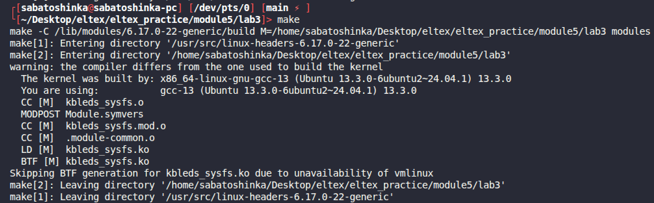
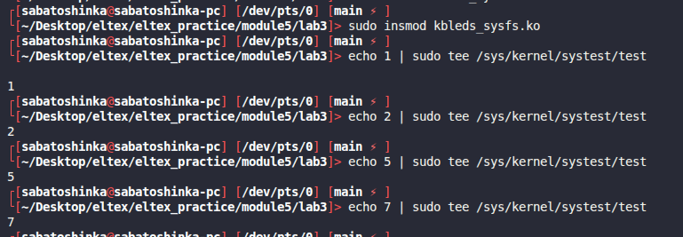

# Module 5 lab 3

## Сборка

```bash
make
```

## Запуск и проверка

```bash
sudo insmod kbleds_sysfs.ko
cat /sys/kernel/systest/test
echo 1 | sudo tee /sys/kernel/systest/test
echo 2 | sudo tee /sys/kernel/systest/test
echo 4 | sudo tee /sys/kernel/systest/test
echo 7 | sudo tee /sys/kernel/systest/test
sudo rmmod kbleds_sysfs
```
Работает побитовая маска лампочек клавиатуры

* 1 = 001
* 2 = 010
* 4 = 100

Соответственно можно перебирать комбинации.
* 3 = 011 = первая + вторая
* 5 = 101 = первая + третья
* 6 = 110 = вторая + третья
* 7 = 111 = все три


## Скриншоты работы
Информация о модуле:



Сборка модуля:



Загрузка модуля:


