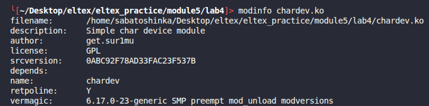
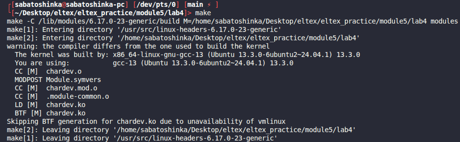
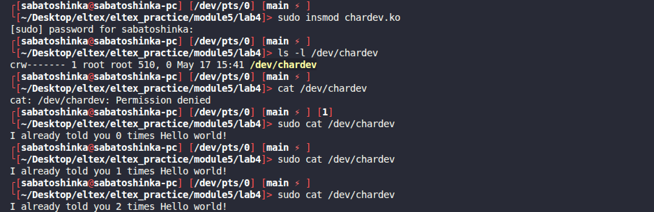

# Module 5 lab 4

## Сборка

```bash
make
```

## Запуск и проверка

```bash
sudo insmod chardev.ko
cat /dev/chardev
cat /dev/chardev
sudo rmmod chardev
```


## Дополнительно
```c
static struct file_operations chardev_fops = {
    .read = device_read,
    .write = device_write,
    .open = device_open,
    .release = device_release,
};
```

Когда мы выполняем 
```bash
cat /dev/chardev
```
1. cat открывает файл, и вызывается device_open()
2. Модуль собирает сообщение 
3. cat читает файл, вызывается device_read()
4. device_read() побайтово отдает строку из msg в userpsace
5. cat закрывает файл вызывается device_release()

## Скриншоты работы

Информация о модуле:



Сборка модуля:



Загрузка модуля:


