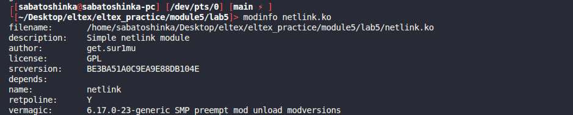
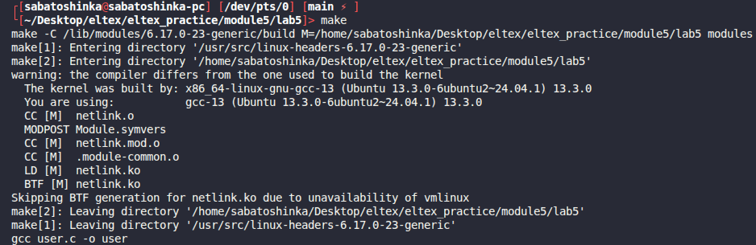
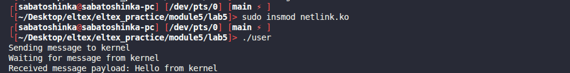
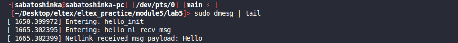

# Module 5 lab 5

## Сборка

```bash
make
```

## Запуск и проверка

```bash
sudo insmod netlink.ko
./user
dmesg | tail
sudo rmmod netlink
```

## Скриншоты работы

Информация о модуле:



Сборка модуля:



Загрузка модуля:


